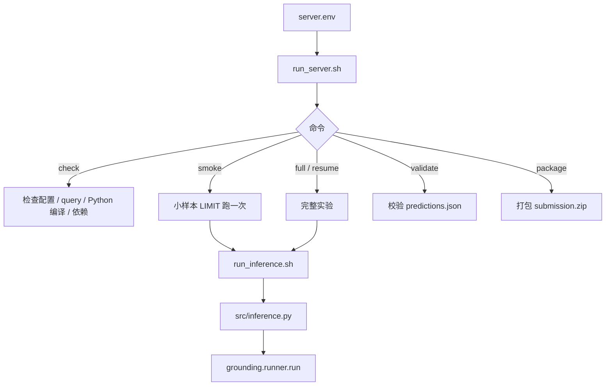
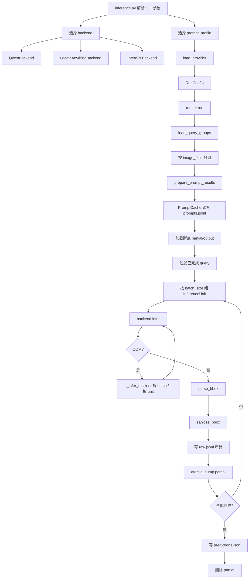
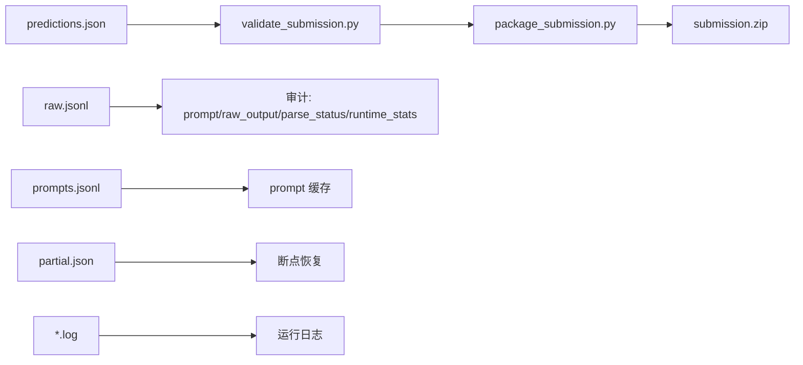
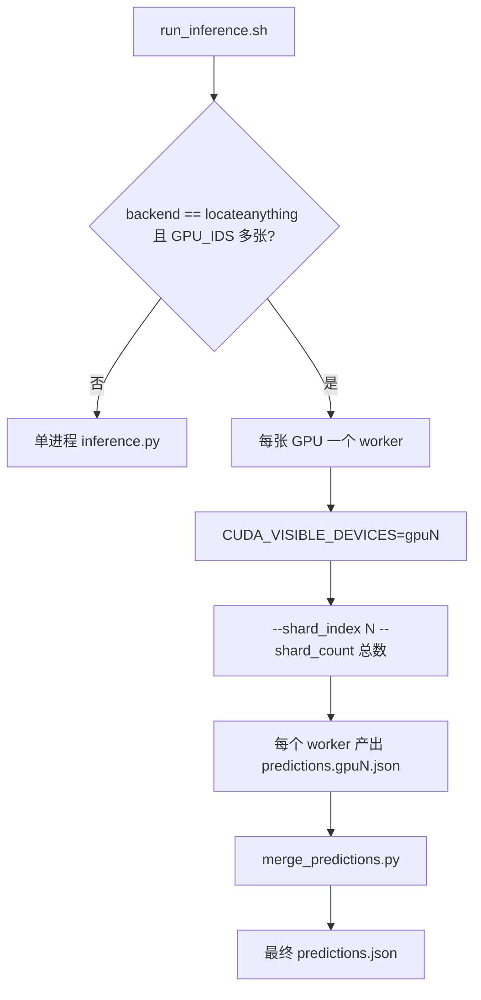
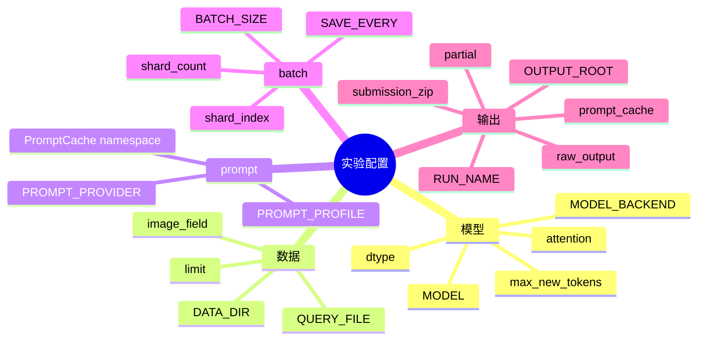
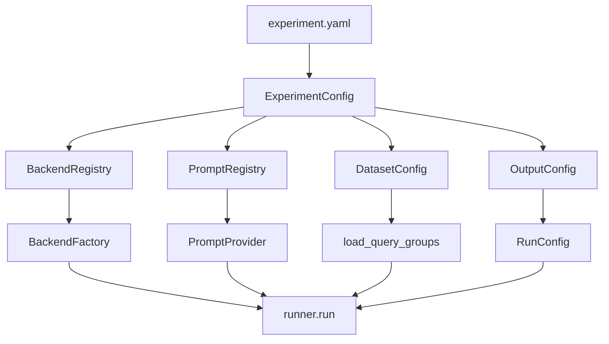

# 当前实验脚本流程与结构

本文用于后续模块化重构前理解现有实验流程。目标：把配置、模型差异、prompt、数据、输出从脚本硬编码中逐步拆出来，减少后续调整实验配置时的代码改动。

## 入口结构

## 核心推理流程

## 输出链路

## 多 GPU 分片

## 当前模块职责

1. `run_server.sh`
   实验命令入口：`check / smoke / full / resume / validate / package`。读取 `server.env`。

2. `run_inference.sh`
   把环境变量拼成 CLI 参数；处理 LocateAnything 多 GPU 分片；最后校验和打包。

3. `src/inference.py`
   唯一 Python 推理入口。负责 argparse、backend config、prompt provider、`RunConfig`。

4. `grounding/runner.py`
   真正流程编排：加载数据、生成 prompt、断点恢复、batch、OOM 拆分、解析 bbox、写结果。

5. `grounding/backends/*.py`
   模型差异层。当前有 `qwen`、`locateanything`、`internvl`。

## 当前可调项

## 硬编码与模块化重点

1. `server.env.example` 和 `run_inference.sh` 里 backend 默认 profile 重复写了两遍。后续应收敛到一个配置源。

2. `run_inference.sh` 写死 `QUERY_FILE="${DATA_DIR}/queries/queries.json"`。后续应允许实验配置显式声明 query 文件。

3. `PROMPT_PROFILES` 在 `prompts.py` 写死为 tuple。后续可改成 registry/config，避免新增 profile 时改核心代码。

4. `inference.py` 的 argparse 混合了通用参数和各 backend 参数。后续可拆成 `ExperimentConfig + BackendConfig`。

5. backend 选择是 `if/elif/else`。后续可改成 backend registry：`name -> config parser -> backend factory`。

## 建议的目标结构

最小重构方向：先把 `server.env + run_inference.sh 参数拼接` 合并成一个 `experiment.yaml` 或 JSON 配置加载器；`runner.py` 暂时别动，它已经相对干净。
